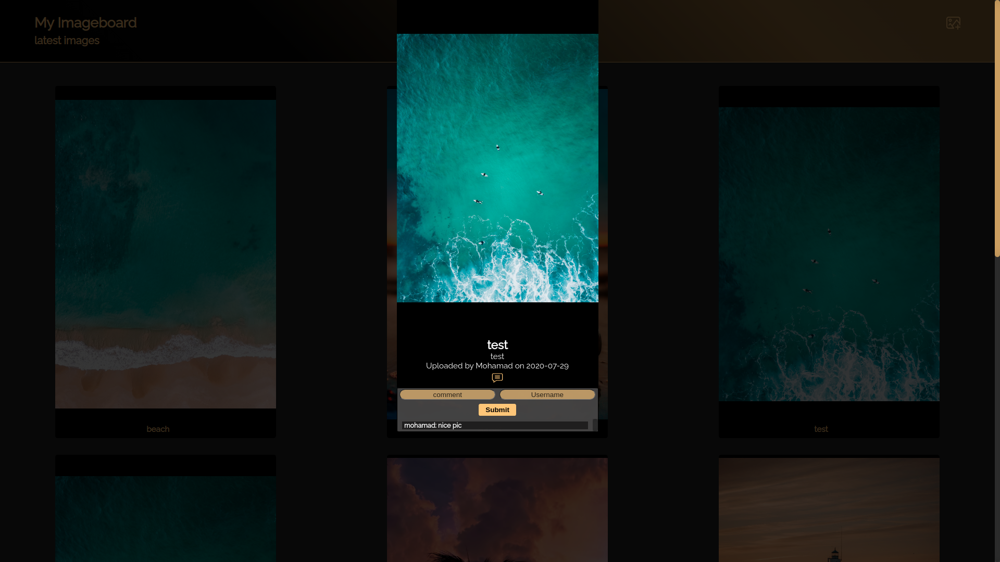

# Image Board

## About the project:

-   The project is an Image board where users can upload and comment on images.

## Available Scripts:

#### npm start

Runs the app in the development mode.
Open http://localhost:8080 to view it in the browser.

The page will reload if you make edits.
You will also see any lint errors in the console.

## Technologies:

-   Vue.js
-   Node.js
-   Express
-   PostgreSQL
-   AWS S3

## Features:

-   Mobile responsive design.

-   Infinite scroll to load older photos.

-   Upload a photo to AWS S3 from a file.

-   Users can add comments on every image, and see other users' comment.

 
